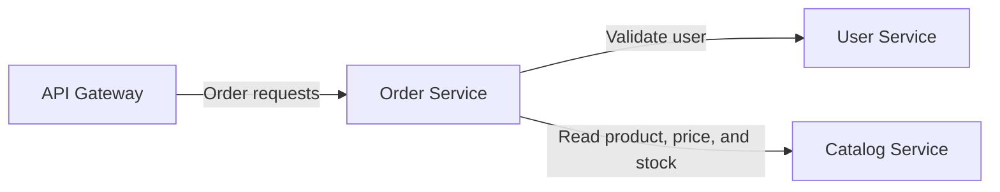

# NexusCart Order Service

The Order Service is a Java and Spring Boot API that validates customers and
products, snapshots current catalog data, calculates VND totals, and stores
orders in memory.

## ✨ Highlights

- Java 21 and Spring Boot 3.5.
- Server-side user, product, stock, currency, and duplicate-item validation.
- Product name and price snapshots captured when an order is created.
- Overflow-safe line and order total calculations.
- Newest-first order history.
- End-to-end `X-Request-ID` propagation to downstream services and logs.
- Versioned health reporting through `GET /health` and process probing through `GET /liveness`.
- Multi-stage container build with a non-root runtime user.

## 🧭 Service Context



The Order Service never trusts prices sent by a client. For every item, it reads
the current product from the Catalog Service and calculates the total on the
server.

## 🔌 API

| Method | Path | Success | Description |
|---|---|---:|---|
| `GET` | `/health` | `200` | Service identity and deployed version |
| `GET` | `/liveness` | `200` | Dependency-free process liveness |
| `GET` | `/api/v1/orders` | `200` | Orders in newest-first order |
| `GET` | `/api/v1/orders/{id}` | `200` | One order by ID |
| `POST` | `/api/v1/orders` | `201` | Validate and create an order |

## 🧪 Create an Order

```bash
curl -i \
  -X POST http://localhost:8083/api/v1/orders \
  -H "Content-Type: application/json" \
  -H "X-Request-ID: docs-order-001" \
  -d '{
    "userId": "usr-001",
    "items": [
      {"productId": "prd-001", "quantity": 2}
    ]
  }'
```

The service returns `201 Created`, a `Location` header, and the calculated
order:

```json
{
  "id": "ord-001",
  "userId": "usr-001",
  "items": [
    {
      "productId": "prd-001",
      "productName": "Mechanical Keyboard",
      "unitPrice": 1290000,
      "quantity": 2,
      "lineTotal": 2580000
    }
  ],
  "totalAmount": 2580000,
  "currency": "VND",
  "status": "CREATED",
  "createdAt": "2026-08-11T08:30:00Z"
}
```

Each item quantity must be between `1` and `99`, and a product may appear
only once in a request.

## ⚠️ Error Contract

| Status | Code | Meaning |
|---:|---|---|
| `404` | `ORDER_NOT_FOUND` | Requested order does not exist |
| `409` | `INSUFFICIENT_STOCK` | Requested quantity exceeds current stock |
| `422` | `VALIDATION_ERROR` | Body is missing, malformed, or violates constraints |
| `422` | `DUPLICATE_PRODUCT` | A product appears more than once |
| `422` | `USER_NOT_FOUND` | Referenced user does not exist |
| `422` | `PRODUCT_NOT_FOUND` | Referenced product does not exist |
| `422` | `UNSUPPORTED_CURRENCY` | Product currency is not VND |
| `422` | `ORDER_TOTAL_OVERFLOW` | A calculated total exceeds the supported range |
| `503` | `USER_SERVICE_UNAVAILABLE` | User Service cannot be reached |
| `503` | `CATALOG_SERVICE_UNAVAILABLE` | Catalog Service cannot be reached |

Errors use the common NexusCart shape:

```json
{
  "error": {
    "code": "INSUFFICIENT_STOCK",
    "message": "Product prd-001 only has 10 item(s) in stock",
    "requestId": "docs-order-001"
  }
}
```

## 🚀 Quick Start

### Prerequisites

- Java 21.
- User Service on `http://localhost:8081`.
- Catalog Service on `http://localhost:8082`.

```bash
./mvnw test
./mvnw spring-boot:run
```

On Windows, use `mvnw.cmd` instead of `./mvnw`. The default service URL is
<http://localhost:8083>.

For a complete environment with all dependencies, use Docker Compose from the
sibling `config-management` repository.

## ⚙️ Runtime Configuration

| Variable | Default | Purpose |
|---|---|---|
| `PORT` | `8083` | HTTP listen port |
| `APP_VERSION` | `1.0.0` | Version returned by `GET /health` |
| `USER_SERVICE_URL` | `http://localhost:8081` | User Service base URL |
| `CATALOG_SERVICE_URL` | `http://localhost:8082` | Catalog Service base URL |

Downstream calls have a three-second read timeout.

## 💾 Data Lifecycle

Orders live in a process-local, thread-safe in-memory repository. IDs start at
`ord-001` after each restart, and all orders are lost when the process stops.
The production Helm values therefore keep this service at one replica until
shared persistence is introduced.

## ✅ Quality Gates

```bash
./mvnw test
```

The tests cover health reporting, application startup, order calculations,
duplicate products, stock validation, and repository behavior. The Docker build
runs `mvn verify` before producing the runtime image.

## 🐳 Container Image

```bash
docker build -t nexuscart-order-service:local .
docker run --rm -p 8083:8083 \
  -e APP_VERSION=local \
  -e USER_SERVICE_URL=http://host.docker.internal:8081 \
  -e CATALOG_SERVICE_URL=http://host.docker.internal:8082 \
  nexuscart-order-service:local
```

The final image runs as UID `10001` and exposes port `8083`. The
`host.docker.internal` example is intended for Docker Desktop; use Compose for
a portable multi-container setup.

## 🔁 CI/CD

`azure-pipelines.yml` is a small entry point that composes reusable checkout,
Java setup, Maven verification, report, and Qodana step templates from
`config-management`. Shared stage and job templates own the orchestration.

- Every branch publishes JUnit and coverage reports, runs Qodana, builds the
  image, and scans it with Trivy.
- `main` pushes the `$(Build.BuildId)` and `latest` tags to Azure Container
  Registry.

## 📁 Repository Structure

```text
order-service/
├── src/main/java/com/nexuscart/order/
│   ├── api/                # REST controllers and request models
│   ├── client/             # User and Catalog clients
│   ├── domain/             # Order and item records
│   ├── error/              # Common API errors
│   ├── repository/         # In-memory storage
│   ├── request/            # Request ID filter
│   └── service/            # Order validation and calculation
├── src/main/resources/application.yml
├── src/test/               # Controller, context, and domain tests
├── azure-pipelines.yml
├── Dockerfile
├── mvnw
├── mvnw.cmd
└── pom.xml
```
